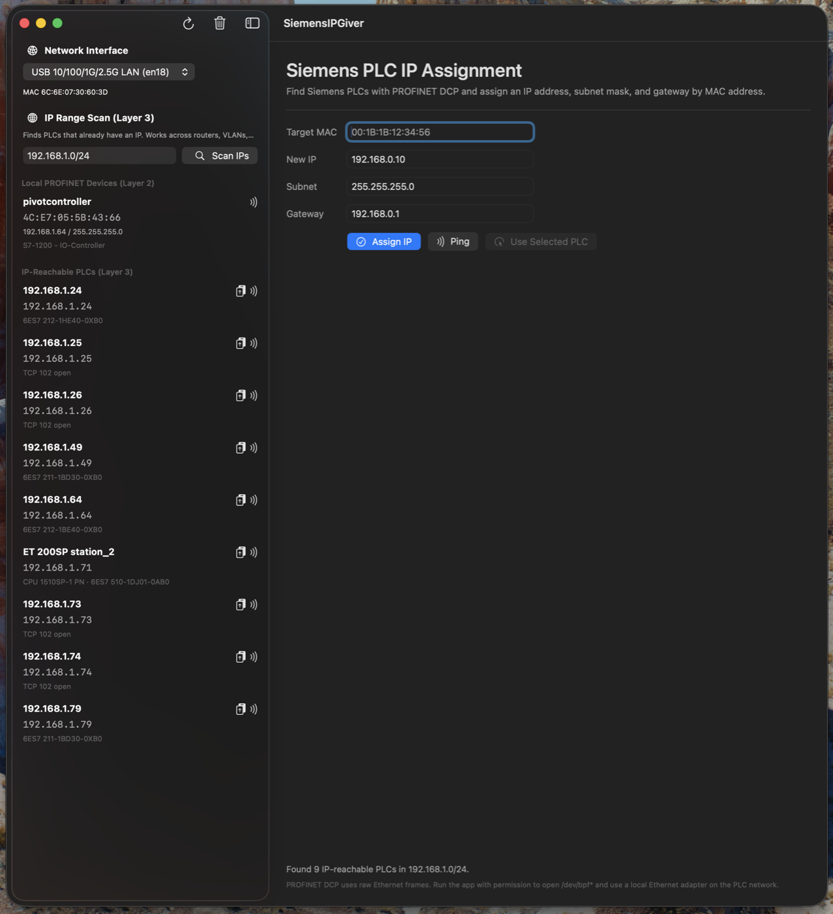

# SiemensIPGiver

SiemensIPGiver is a macOS utility for finding Siemens PLCs on a local network and assigning an IP configuration to a selected PLC by MAC address.

The app is intended for commissioning and maintenance workflows where a Siemens PLC is reachable on the local Ethernet segment but does not yet have the correct IP address.



## Features

- Discover Siemens PLCs on the local network.
- Identify PLCs by MAC address.
- Assign IP address, subnet mask, and gateway.
- Show discovered PLC network information in a native macOS UI.
- Package for distribution outside the Mac App Store with Developer ID signing and Apple notarization.

## Network Requirements

PLC discovery and IP assignment use local network access. For PLCs without an IP address, the app must use low-level Ethernet access through macOS BPF devices (`/dev/bpf*`). That means:

- The Mac must be on the same local Ethernet segment as the PLC.
- A wired Ethernet adapter is recommended.
- The app is not sandboxed, because sandboxed macOS apps cannot open BPF devices.
- Users should install the signed `.pkg`, which configures BPF access with a LaunchDaemon instead of requiring Gatekeeper, SIP, or global security settings to be disabled.

## User Installation

Download or distribute the signed and notarized package:

```text
Distribution/Installer/SiemensIPGiver-signed.pkg
```

The installer places the app in `/Applications` and installs a LaunchDaemon that grants the local app group access to `/dev/bpf*`.

After installation, users may need to log out and back in if group membership changes do not apply immediately.

To verify the downloaded installer:

```sh
shasum -a 256 -c Distribution/Installer/SiemensIPGiver-signed.pkg.sha256
spctl --assess --type install --verbose=4 Distribution/Installer/SiemensIPGiver-signed.pkg
```

## Development Build

Open the project in Xcode:

```sh
open SiemensIPGiver.xcodeproj
```

Or build from the command line:

```sh
xcodebuild build \
  -project SiemensIPGiver.xcodeproj \
  -scheme SiemensIPGiver \
  -destination 'platform=macOS'
```

## Release Build

The release packaging flow is in [Distribution](Distribution/README.md).

Required local credentials:

- A `Developer ID Application` certificate for your Apple Developer team.
- A `Developer ID Installer` certificate for your Apple Developer team.
- A `notarytool` keychain profile.

Build, sign, notarize, and staple the installer:

```sh
DEVELOPMENT_TEAM_ID=YOUR_TEAM_ID \
NOTARY_PROFILE=YOUR_NOTARY_PROFILE \
Distribution/build-release.sh
```

If your installer certificate name is ambiguous, pass it explicitly:

```sh
DEVELOPMENT_TEAM_ID=YOUR_TEAM_ID \
DEVELOPER_ID_INSTALLER="Developer ID Installer: Your Company (YOUR_TEAM_ID)" \
NOTARY_PROFILE=YOUR_NOTARY_PROFILE \
Distribution/build-release.sh
```

Verify the package before distribution:

```sh
spctl --assess --type install --verbose=4 build/ReleaseDistribution/SiemensIPGiver-signed.pkg
pkgutil --check-signature build/ReleaseDistribution/SiemensIPGiver-signed.pkg
xcrun stapler validate build/ReleaseDistribution/SiemensIPGiver-signed.pkg
```

Expected Gatekeeper result:

```text
accepted
source=Notarized Developer ID
```

## Security Model

The app follows the standard Apple path for non-App-Store macOS distribution:

- Developer ID signed app.
- Hardened Runtime enabled.
- Developer ID signed installer package.
- Apple notarization.
- Stapled notarization ticket.

Do not instruct users to disable Gatekeeper, SIP, or "Allow apps downloaded from Anywhere."

## Repository Layout

- `SiemensIPGiver/`: macOS app source.
- `SiemensIPGiverTests/`: unit tests.
- `SiemensIPGiverUITests/`: UI test target.
- `Distribution/`: release packaging scripts, LaunchDaemon files, and signing/notarization notes.
